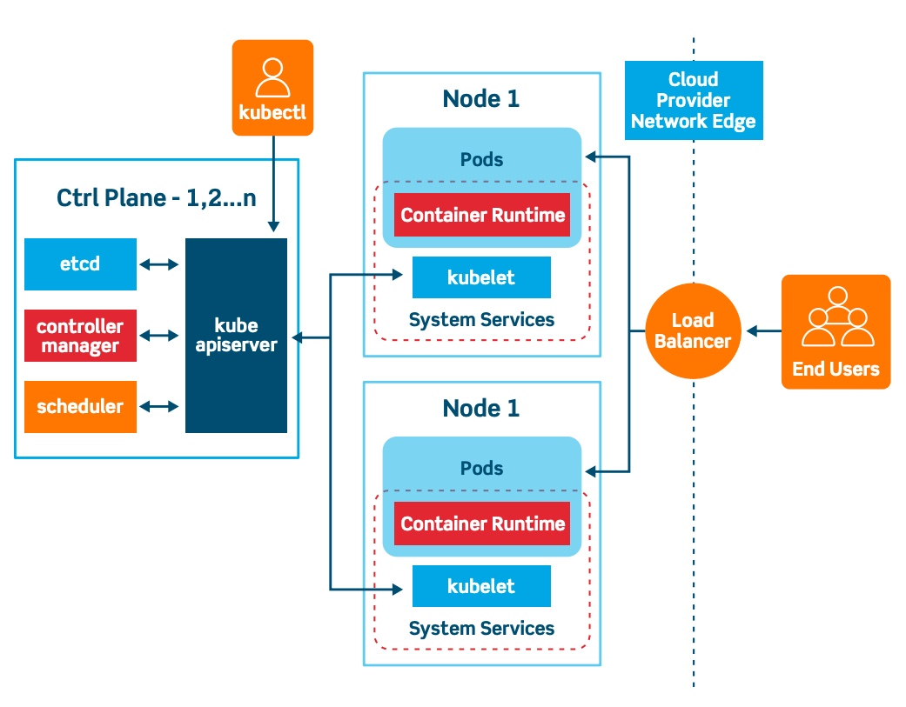

# Interview Qeustions

## 1. What is kubernetes

Kubernetes is a portable, extensible, open source platform for managing containerized workloads and services, that facilitates both declarative configuration and automation.

## 2. Kubernetes Architecture

The Kubernetes environment consists of a control plane (or the master), a distributed storage system (etcd) that keeps the cluster state consistent, and any number of cluster nodes, or Kubelets. Kubernetes conforms to a client-server architecture, with the master installed on one machine and the nodes on separate machines.

## 3. Is multiple masters possible for kubernetes?

It’s possible to have multiple masters due to high availability demands, the accepted default setup features one master server that works as a point of contact and controlling node.

## 4. Three principles that Kubernetes architecture follows

- It’s secure, abiding by the most current security best-practices at multiple levels (application, cluster, and network)

- It's easy to use, operable with only a few simple commands

- It’s highly portable, running on any mainstream Linux distribution, either bare metal or virtual machine processors and different cloud providers (AWS, Azure, Google Cloud). It also allows new container runtimes and supports workloads across multi-cloud and hybrid environments.

## 5. Fundamental concept of kubernetes arcchitecture

- **Pod:** A group of containers
- **Labels:** Used to identify pods
- **Kubelet:** Container agents responsible for maintaining pod sets
- **Proxy:** Pod load balancers that help distribute tasks
- **Etcd:** A metadata service
- **CAdvisor:** Monitors resource performance and usage
- **Replication controller:** Manages pod replication
- **Scheduler:** Schedules pods in worker nodes

## 6. Kubernetes Components

A working Kubernetes deployment is known as a cluster. A Kubernetes cluster consists of a set of worker machines, called nodes, that run containerized applications. Every cluster has at least one worker node.

Kubernetes components contains:

1. Master Node (control plane)

2. Work Node (at lease one in cluster)

### Control plane

The control plane's components make global decisions about the cluster (for example, scheduling), as well as detecting and responding to cluster events (for example, starting up a new pod when a deployment's replicas field is unsatisfied).

_Principle:_ Control plane components can be run on any machine in the cluster. However, for simplicity, set up scripts typically start all control plane components on the same machine, and do not run user containers on this machine.

- kube-apiserver: The API server is the front end for the Kubernetes control plane.
- Etcd: Consistent and highly-available key value store used as Kubernetes' backing store for all cluster data.
- kube-scheduler: Control plane component that watches for newly created Pods with no assigned node, and selects a node for them to run on.
- kube-controller-manager: This component runs the controller process, including node controllers, endpoints controllers, replication controllers, service accounts, and token controllers.
  - Node controller: Responsible for noticing and responding when nodes go down.
  - Job controller: Watches for Job objects that represent one-off tasks, then creates Pods to run those tasks to completion.
  - Endpoints controller: Populates the Endpoints object (that is, joins Services & Pods).
  - Service Account & Token controllers: Create default accounts and API access tokens for new namespaces.
- Cloud-controller-manager: The manager links your cluster into your cloud provider's API. It separates the components that interact with the chosen cloud platform from the components that only interact with your cluster.

### Node Components

Node components run on every node, maintaining running pods and providing the Kubernetes runtime environment.

- **Kubelet:** This agent ensures that containers are running in a pod.
- **Kube-proxy:** This proxy maintains network rules on nodes. These rules allow network communication from sessions inside or outside of your cluster to your pods.
- **Container runtime:** This software runs containers. Kubernetes supports various container runtimes like Containerd, CRI-O, Docker, or any Kubernetes Container Runtime Interface (CRI) implementation.

### Addons

- **Cluster DNS:** Cluster DNS serves DNS records for Kubernetes services. Although addons aren’t strictly mandatory, Kubernetes clusters should have a DNS because many examples depend on it.
- **Web UI:** The Web UI is a general-purpose dashboard for Kubernetes clusters. It lets users manage and troubleshoot the cluster plus any applications running in it.
- **Container Resource Monitoring:** This addon records generic time-series metrics regarding the central database’s containers and provides a UI for browsing the data.
- **Cluster-Level Logging:** This mechanism saves container logs to a central log store with a searching and browsing interface.

## 7. How are Kubernetes and Docker related?

Docker is an open-source platform used to handle software development. Its main benefit is that it packages the settings and dependencies that the software/application needs to run into a container, which allows for portability and several other advantages.

Kubernetes allows for the manual linking and orchestration of several containers, running on multiple hosts that have been created using Docker.

## 8. What is the difference between deploying applications on hosts and containers?

Deploying Applications consist of an architecture that has an operating system. The operating system will have a kernel that holds various libraries installed on the operating system needed for an application.

Whereas container host refers to the system that runs the containerized processes. This kind is isolated from the other applications; therefore, the applications must have the necessary libraries. The binaries are separated from the rest of the system and cannot infringe any other application.

## 9. Explain the working of the master node in Kubernetes?

The master node dignifies the node that controls and manages the set of worker nodes. This kind resembles a cluster in Kubernetes. The nodes are responsible for the cluster management and the API used to configure and manage the resources within the collection. The master nodes of Kubernetes can run with Kubernetes itself, the asset of dedicated pods.

## 10. What is a node in Kubernetes?

A node is the smallest fundamental unit of computing hardware. It represents a single machine in a cluster, which could be a physical machine in a data center or a virtual machine from a cloud provider. Each machine can substitute any other machine in a Kubernetes cluster. The master in Kubernetes controls the nodes that have containers.

## 11. List 4 types of kubernetes services?

- ClusterIP

  Default Kubernetes service, only internal access, not external

- NodePort

- ExternalName

- LoadBalancer

Reference:

https://www.simplilearn.com/tutorials/kubernetes-tutorial/kubernetes-interview-questions?source=sl_frs_nav_playlist_video_clicked#kubernetes_interview_questions_and_answers
